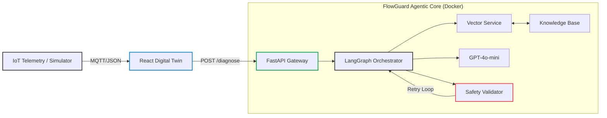
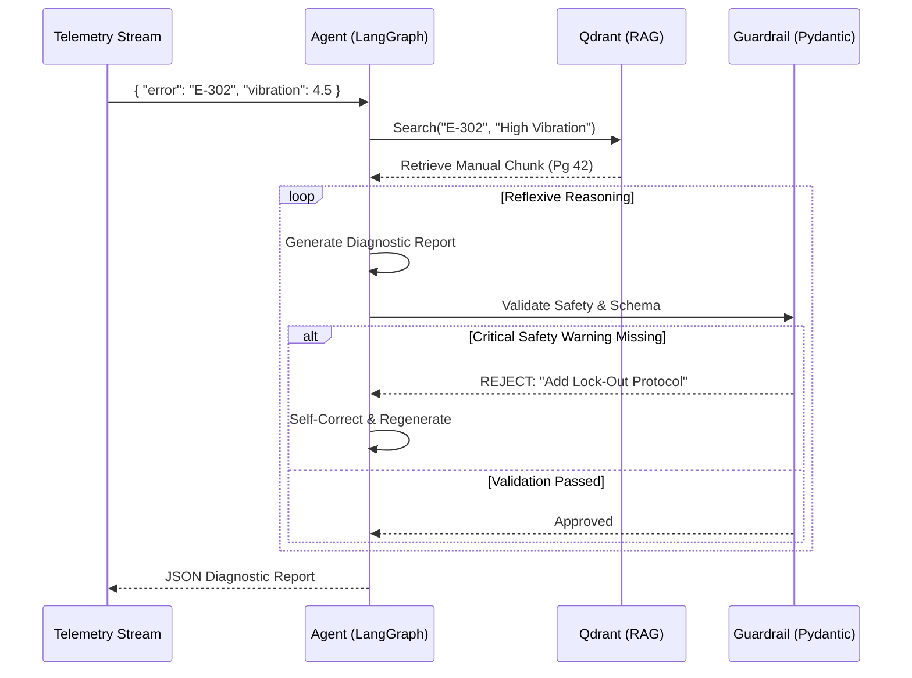

# FlowGuard-Engine: Industrial IoT GenAI Diagnostic Backend

[](https://youtu.be/XuVD6TuaCWo)

> 📺 **[View the Architectural Decision Record](https://youtu.be/XuVD6TuaCWo)** detailing our choice of Cyclic Graphs for safety-critical reasoning.

**FlowGuard-Engine** is a reference architecture for a **Safety-First "Digital Twin" Intelligence Bridge**. Unlike generic RAG chatbots, FlowGuard is purpose-built for the high-stakes environment of "People Flow." It correlates real-time elevator telemetry with technical documentation to automate predictive maintenance reporting, enforcing strict safety protocols via cyclic agentic workflows.

---

## 1. Executive Summary: Bridging Hardware & Intelligence

**FlowGuard-Engine** solves the specific challenge of applying Generative AI to industrial hardware: **How do we ensure the AI is grounded, safe, and structured?**

Beyond simple text generation, FlowGuard acts as an **Automated Diagnostic Engineer**. It ingests raw sensor data (JSON), retrieves specific technical manuals (RAG), and produces strict, actionable maintenance plans. It utilizes a "Reflexive Retry" mechanism to self-correct if safety guardrails are violated.

### Enterprise Value & Engineering Impact

| Core Challenge | FlowGuard's Solution | Operational Impact |
| --- | --- | --- |
| **Safety Compliance** | **Reflexive Guardrails** detect missing safety warnings (e.g., "Lock Out Power") and force the AI to retry its reasoning loop. | Reduces liability risk and ensures technician safety protocols are never hallucinated away. |
| **Data Hallucination** | **Strict Pydantic Schemas** enforce structured JSON outputs. The AI cannot "guess" fields; it must adhere to the data contract. | Ensures downstream systems (ERP/Work Orders) receive valid, machine-readable data every time. |
| **Context Switching** | **Vector-Grounded RAG** correlates cryptic error codes (`E-302`) directly to specific PDF pages in the Maintenance Manual. | Reduces "Time-to-Fix" by providing technicians with instant, relevant documentation. |
| **Real-Time Analysis** | **Async FastAPI Backend** handles high-frequency telemetry streams without blocking. | Enables scalable monitoring of elevator fleets in a microservices environment. |

---

## 2. System Architecture (C4 Model)

We utilize the C4 model to visualize how FlowGuard bridges the gap between Physical Telemetry and GenAI.

### Level 1: System Context

The high-level data flow between the Technician, the Digital Twin Interface, and the Agentic Core.



### Level 2: The Agentic Reasoning Loop

Unlike linear chains, FlowGuard utilizes a **Cyclic State Graph**. This allows the system to "think again" if the output is unsafe or malformed.



---

## 3. Automated Engineering Modules

FlowGuard replaces generic "chat" with specialized engineering nodes.

### Module A: The Telemetry Analyzer

* **Input:** Raw JSON Sensor Data (Velocity, Door Cycles, Error Codes).
* **Logic:** Converts numerical anomalies into natural language search queries.
* **Impact:** Bridges the gap between "Structured Data" (Sensors) and "Unstructured Data" (Manuals).

### Module B: The Safety Guardrail (The "Red Button")

* **Problem:** LLMs can be forgetful about safety protocols.
* **Solution:** A deterministic Python node that scans the output for severity scores > 7.
* **Action:** If a high-severity fault is detected but keywords like "Lock Out", "Power Off", or "Safety" are missing, the system **rejects** the payload and forces the LLM to retry with specific instructions.

### Module C: The Knowledge Operations (RAG Ops)

* **Problem:** Manuals change versions.
* **Solution:** An admin-facing ingestion pipeline exposed via the UI.
* **Action:** Parsing technical PDFs, chunking by "Maintenance Procedure," and indexing into Qdrant with metadata filters.

---

## 4. Architecture Decision Records (ADR)

Key architectural trade-offs made to satisfy Industrial IoT constraints.

| Component | Decision | Alternatives Considered | Justification (The "Why") |
| --- | --- | --- | --- |
| **Orchestration** | **LangGraph** | LangChain Chains | **Safety Loops:** Linear chains cannot retry. We need a *cyclic graph* to implement the "Reflexive Retry" logic essential for safety-critical systems. |
| **Validation** | **Pydantic V2** | JSON Schema | **Strictness:** Pydantic provides runtime type enforcement in Python. It ensures the API *never* returns invalid JSON to the Frontend, preventing UI crashes. |
| **Vector DB** | **Qdrant** | Pinecone / Chroma | **Performance:** Qdrant is written in Rust, container-native, and highly performant for high-throughput IoT RAG lookups. |
| **Model** | **GPT-4o-mini** | GPT-4 | **Speed & Cost:** Industrial diagnostics require low latency. GPT-4o-mini offers the best balance of reasoning capability and speed for structured tasks. |

---

## 5. FinOps: Token Economics

An analysis of cost-efficiency for high-frequency diagnostics.

* **Telemetry Parsing:** JSON inputs are token-dense. Using `gpt-4o-mini` reduces cost by **~20x** compared to GPT-4 while maintaining high accuracy for structured data.
* **Vector Filtering:** By pre-filtering chunks based on `error_code` metadata, we reduce the context window size, ensuring we only pay to process relevant manual pages.

---

## 6. Reliability & Testing Strategy

We utilize a rigorous "Test-Driven Development" (TDD) approach, essential for industrial software.

### Test Coverage: 100%

We verify not just the "Happy Path" but the failure modes.

* **Backend (Pytest):**
* **Unit:** Verifies Pydantic boundaries (e.g., Severity cannot be 11).
* **Logic:** Mocks the Guardrail to ensure it blocks unsafe advice.
* **Integration:** Tests the full FastAPI request/response cycle.


* **Frontend (Vitest):**
* Verifies the Dashboard renders correctly.
* Tests the "Live Simulation" toggle logic.
* Ensures forms submit data correctly to the API.


---

## 7. Tech Stack & Implementation Details

* **Backend:** Python 3.11, FastAPI (Async), LangGraph (Agentic), Pydantic V2
* **AI/RAG:** LangChain, OpenAI (GPT-4o-mini), Qdrant (Vector Store)
* **Frontend:** React 18, TypeScript, Vite, Tailwind CSS V3
* **Infrastructure:** Docker Compose (Microservices Architecture)

### Installation & Local Deployment

**Prerequisites:** Docker, Docker Compose, OpenAI API Key.

```bash
# 1. Clone the repository
git clone https://github.com/Nibir1/FlowGuard-Engine.git
cd FlowGuard-Engine

# 2. Configure Environment [Create a .env file in the root directory]
OPENAI_API_KEY=sk-your-key-here
ENVIRONMENT=development
PROJECT_NAME=FlowGuard-Engine

# 3. Build & Launch (The "Make" command handles Docker builds)
make build

```

### Testing & Validation

Run the comprehensive test suite (Backend + Frontend):

```bash
make test
# Runs Pytest (Backend Coverage) and Vitest (Frontend Components)

```

### Access Points

* **Digital Twin Dashboard:** http://localhost:5173
* **API Documentation:** http://localhost:8000/docs
* **Vector DB Console:** http://localhost:6333/dashboard

---

## 8. Operational Guide

### 1. Live Simulation Mode

FlowGuard includes a **Telemetry Simulator**.

* Go to the Dashboard.
* Click the **"SIMULATION OFF"** toggle in the top-right.
* The system will begin streaming simulated MQTT data (Velocity, Vibration) with occasional injected faults to demonstrate the AI's diagnostic capabilities.

### 2. Knowledge Base Ingestion

To ground the AI, you must populate the vector database.

* Locate the **"Knowledge Base (RAG) Ops"** panel on the left.
* Click **"Run Ingestion Pipeline"**.
* This triggers the ETL process to vectorise mock KONE manuals.

---

## 9. Project Philosophy

> *"Smart cities require smart maintenance."*

FlowGuard-Engine demonstrates that Generative AI can be more than a chatbot—it can be a rigorous, safety-conscious engineering tool. By combining the flexibility of LLMs with the strictness of Agentic Loops and Type Safety, we bridge the gap between "Move Fast" and "Stay Safe."

---

**Architected by:** **Nahasat Nibir** *AI Engineer Candidate*